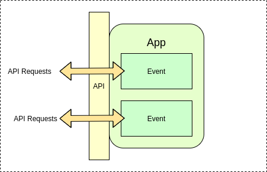
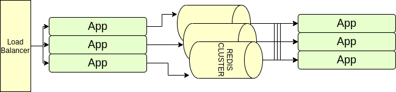

# hopeit.engine

A comprehensive framework for modular and scalable architectures to develop and serve modern Microservices-based AI/Machine Learning applications


**hopeit.engine** for Microservices development:

* Handles communication between the services in a synchronous or asynchronous way without the need of complex infrastructure setup.

* Enforces best practices like API and messages schema management, testing, tracing, logging, monitoring and reusability of components.

* Allows deploying to common stack like Kubernetes on any Cloud Infrastructure Provider. It can also be adapted to serverless stacks.


**hopeit.engine** for AI scenarios:

* Designed to facilitate the implementation of complex Machine Learning systems. 

* Enables Machine Learning scenarios providing ways to manage and store datasets and artifacts.

* Helps ensuring consistency between model training, testing and inference times, a common Machine Learning challenge in production systems.

* Based on Python, which gives access to numerous AI libraries and tools.


**hopeit.engine** drives development speed:

* Enforced modular design ensure less duplication and zero-boilerplate code: focus development on your product or platform needs
  
* Open-source, easy to learn and apply to new scenarios with reduced on-board times


**Microservices with Data Streams**

*hopeit.engine* is a library and runtime that allows development and deployment of event-driven applications in Python. It provides a way to create APIs, orchestrate workflows using data streams, test, deploy and scale services. It also provides a flexible way to design, understand, run and visualize your apps, events and data dependencies.


**Fast and Robust**: it relies on `pydantic 2.x` for dataclasses serialization and schemas, on `aiohttp` for web services and supports pluggable stream managers to connect to your preferred event queue like `Redis Streams`. It is async by default and performance is comparable to REST frameworks like `FastAPI`.

**Data-driven & AI Applications**: it is particularly well-suited for running data-driven applications like machine-learning training and serving thanks to the tight integration with `pandas` using the `hopeit.dataframes` plugin, allowing serialization and data transfer via endpoints and streams.


### Installation

Typical installation to use `aiohttp` server and command-line utilities.
```
pip install hopeit.engine[web,cli]
```

To enable stream processing via Redis:
```
pip install hopeit.engine[web,cli,redis-streams]
```


#### Supported Plugins:


**hopeit.redis_streams**

Plugin implementing backend to use Redis for stream processing in `hopeit.engine`.

```
pip install hopeit.engine[redis-streams]
```


**hopeit.apps_client**

Plugin to invoke other applications based on `hopeit.engine` using http GET and POST requests, with retrying and circuit breaker.

```
pip install hopeit.engine[apps-client]
```


**hopeit.apps_visualizer**

Plugin that displays a web page with event dependencies, allowing live monitoring of multiple application instances.

```
pip install hopeit.engine[apps-visualizer]
```


**hopeit.config_manager**

Plugin that exposes runtime configuration for servers. Enables hosts to be monitored with `apps-visualizer`.

```
pip install hopeit.engine[config-manager]
```


**hopeit.log_streamer**

Plugin that can be run in a separate process and parses logs from running hopeit apps, publishing relevant
entries to a stream allowing live monitoring of applications activity.

```
pip install hopeit.engine[log-streamer]
```


**hopeit.fs_storage**

Python library that exposes helpers to persist data objects to local filesystem.

```
pip install hopeit.engine[fs-storage]
```


**hopeit.redis_storage**

Python library that exposes helpers to persist data objects to Redis.

```
pip install hopeit.engine[redis-storage]
```

**hopeit.dataframes**

Plugin to support working with `pandas` dataframes as they were objects,
supporting them as web request and response payloads and transferring them
through streams.

```
pip install hopeit.engine[dataframes]
```

**AWS Support**

Plugins supporting integration with *Amazon Web Services* can be found in 
[*hopeit.aws*](https://github.com/hopeit-git/hopeit.aws) repository.


### Motivation

**Small organizations**: *hopeit.engine* is intended initially to enable small organizations and companies, which don't have a huge software development infrastructure, to create new systems with the benefits of microservices: quick to develop, simple and small, easy to maintain and operate. These characteristics allow also migration of existing systems piece by piece to microservices. But that's not all: *hopeit.engine* adds a few features and good practices that all production-grade microservices must have out-of-the-box: modularity, scalability, logging, tracking/tracing, stream processing, metrics and monitoring. 

**Easy learning:** if you want to learn how to develop microservices, *hopeit.engine* is a good starting point, since it will quickly make you productive and at the same time you will learn all the necessary steps and features that a production-grade microservice should have. Only basic Python knowledge is required. *hopeit.engine* was successfully adopted by Full-stack and Backend Software Developers, Data Engineers, and Data Scientists coming from different backgrounds.

**Data-driven**: *hopeit.engine* was thought keeping in mind that most business logic and decisions are, and will be, driven by data. Working with data is a key part of the library. We embrace [*pydantic dataclasses*](https://docs.pydantic.dev/latest/concepts/dataclasses/) and enforce data-types checking on input and output data. The library and plugins provide OpenAPI validation and documentation and a way to share data between applications using streams. *hopeit.engine* is Data Science/Machine Learning friendly. We try to keep the library compatible with Python ecosystem around Machine Learning: Pandas, Jupyter Notebooks and the Scientific Stack. We aim to enable Data Teams to create their own services in a way people with different skills can contribute.

**Streams**: *hopeit.engine* provides the main necessary features for your system to accomplish the objectives of modern, reactive systems: responsiveness, resiliency, scalability and message-driven. The architecture enforced by *hopeit.engine* will lead you to develop small stateless services, primarily running asynchronous operations, that can recover from failure, can scale up quickly and handle more load, and communicate asynchronously with other services and process data using streams.

**For production**: With already a few years used in different organizations, we aim to ease the steps needed to put microservices in production. *hopeit.engine* provides out of the box logging of app events with extra information that allows monitoring, tracking, and measuring requests. It's easily configurable to run in containers and allows extensibility using plugins to add the pieces you need to integrate new microservices into your organization: i.e. plugins are available to integrate authentication and monitoring into your existing infrastructure.
The way applications are structured allow for flexible deployment using Docker Containers and Kubernetes.

Check out our [*docs and tutorials*](https://hopeitengine.readthedocs.io/en/latest/index.html). 

## Adopters & Supporters

Among others, **hopeit.engine** was adopted by the following non-profit organizations:


#### Consejo Nacional de Bomberos Voluntarios de la República Argentina

National Council of Volunteer Firefighters adopted hopeit.engine to create new applications, including APIs for data integration, nation-wide real-time resources monitoring, Firemen Academy, COVID-19 dashboards, to mention just a few examples. hopeit.engine leverages for this organization the ability to ease development of new features at fast speed and allows them to integrate onto the existing software and decouple components using Microservices architecture.


#### Caja de Seguridad Social de Abogados y Procuradores de Santa Fe

Social Security Fund for Lawyers and Attorneys, uses hopeit.engine to automate analysis of texts using in-house LLMs and Natural Language Processing techniques, integrating relevant information into a workflow management system.

Also **hopeit.engine** is used by the following companies:


#### FandS AI Solutions

FandS AI, uses **hopeit.engine** to develop and deploy the ML and business logic components of their AI platform and APIs, enabling fast tailoring Machine Learning models and applications to customer needs, while deploying and scaling in the cloud seamlessly.


> If you want to mention your organization, let us know by opening an 


## Features

- Enables the development of microservices in Python (3.9+).
- Provides a web server for API endpoints. *
- OpenAPI schema validation and docs. *
- Inter-app connectivity via http client with retrying and circuit breaker. *
- Modular and testable application design: each microservice is an app composed of independent events
- Metrics: event durations, events starts, success, failures. Stream processing rates.
- Tracking/tracing: keep track of request ids among applications and multiple events execution.
- Event publishing and consuming to Redis Streams. *
- Log processing.
- Apps and events dependencies visualization and live monitoring.
- Helps to create elegant and well structure code using your preferred IDE.
- Data Science / Machine Learning friendly: dataframes with schema support via the hopeit.dataframes plugin *
- Testing: provides utilities to test from Notebooks or Python testing frameworks.

## Open Source

*hopeit.engine* is Open Source, and we encourage people to adopt it, improve it, and contribute changes back. 
Check [*LICENSE*](LICENSE) file. The library also takes advantage of other well-known python open source libraries to deliver the features described above:

- HTTP endpoints and clients are based on [*aiohttp*](https://pypi.org/project/aiohttp/)
- Dataclasses schemas and serialization are provided by [*pydantic*](https://github.com/pydantic/pydantic)
- Plugin for stream processing is supported using [*Redis*](https://redis.io/) and connected using [*aioredis*](https://pypi.org/project/aioredis/)
- Dataframes plugin is implemented using [*Pandas*](https://github.com/pandas-dev/pandas)


For a full list of required libraries and licenses check [*THIRDPARTY*](THIRDPARTY) file.

## Architecture

A few examples of how microservices can be architected using *hopeit.engine*

### Concepts:

**App**: is a conceptual unit implementing a cohesive piece of behavior, consisting of at least a configuration file plus a python module. An app implements one or many *Events*.

**Event**: is the basic execution unit that is triggered when an endpoint is invoked, or a message is received from a stream. Events can be of GET, POST, STREAM or SERVICE types. GET and POST are triggered from HTTP calls, STREAM when a message is consumed from a data stream and SERVICE events can run continuously. 

**Steps**: each Event can define a list of Steps to be executed when the event is triggered. *hopeit.engine* ensures the ordered execution of steps and dependency based on its inputs/outputs, allowing each step to be concise and independently testable.

**Plugin**: a special type of module that can extend the framework or other Apps functionality.

**Server**: a group of Apps and Plugins, a server configuration file plus an OpenAPI specification file can run together using hopeit.server.web module.

Check [Simple Example Application](apps/examples/simple-example) for examples of supported event types, steps, configuration and OpenAPI specification files. 


### A Simple Microservice



In this schema, we can see a service or *App* created using hopeit.engine. The app orchestrates the implementation for two *Events*, each one accessible using an API endpoint. When an external client sends requests to the route associated with the event, the engine will trigger the execution of the steps defined in the event. Multiple events are served concurrently (but not necessarily in parallel) using [*asyncio*](https://docs.python.org/3/library/asyncio.html)

### Composing API


Many Apps can generate a single API specification and run together in a service unit. This sometimes could be desired to simplify operations. This is useful in small organizations where you don't want to deal with a lot of microservices to manage at the beginning. Later on, the apps can be detached easily and run separately if required.

### Streams


If an external request triggers a process that requires background tasks to run, the process can be split in many events, and even in many services using streams. In this example App 1 is receiving the request and can quickly respond to the client while submitting a message to a *stream*. This is easily configurable just adding a *write_stream* section on the App configuration file. Then a second microservice (App 2) consumes the messages in the stream and performs extra processing, in this example, finally saving the result to a database. This is a powerful tool for reactive systems to use. Streams are not only fast, but they allow to design the systems in a modular way, keep every piece small while providing resiliency especially on data processing scenarios. Check the tutorials on how to develop events that can publish and consume events from streams [here](https://hopeitengine.readthedocs.io/en/latest/tutorials/05-streams.html)

### Scalability and operations



*hopeit.engine* enforces your Apps implementation to be scalable. We mentioned that events are served concurrently using asyncio, but to achieve real parallelism, many instances of an App can run in the same or different server instances. Putting a load balancer (i.e: [NGINX](https://nginx.org/en/) or [HAProxy](http://www.haproxy.org/), in front of your API Server app instances, will ensure serving a high load of requests in parallel. The same scalability/load-balancing pattern applies to stream events processing. You can run many instances of Apps consuming Redis Streams. By using consumer groups, Redis will act as a load-balancer and each App instance will consume events from the stream in parallel. Apps created with *hopeit.engine* are also easy to deploy in containers, like [Docker](https://www.docker.com/). Only a Python runtime and a load-balancer is needed.

## More info


> - Tested on Python 3.9, 3.10, 3.11 and 3.12
> - Types and code style checks with [*mypy*](https://pypi.org/project/mypy), [*ruff*](https://github.com/astral-sh/ruff)
> - *hopeit.engine* unit tested using [*pytest*](https://pypi.org/project/pytest/), required coverage > 90%
> - HTTP server integration tests using [*pytest_aiohttp*](https://pypi.org/project/pytest-aiohttp/)
> - *simple-example* *client-example* and *dataframes-example* applications and plugins integration tests
                                                                      
Please check the [docs](https://hopeitengine.readthedocs.io/en/latest/index.html).

Thank you!
