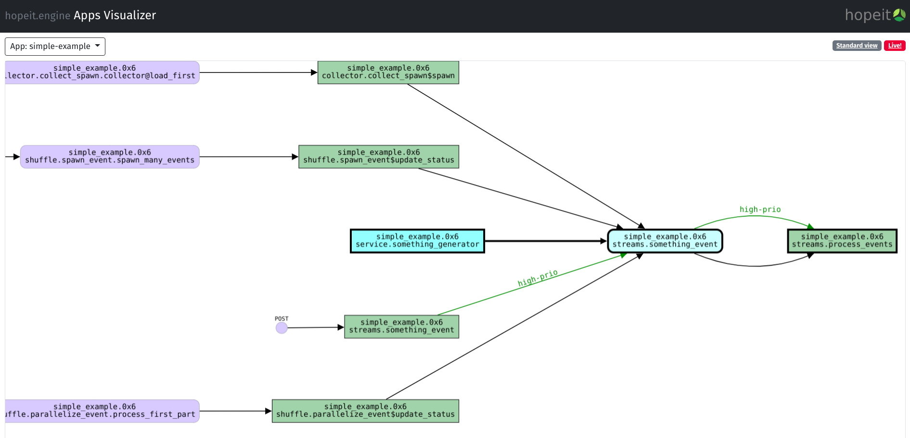

hopeit engine
=============

**“Microservices with Data Streams”**

*hopeit.engine* is a library that allows development and deployment of 
reactive,data driven microservices in Python. It provides a way to create 
APIs, implement business and data driven applications in Python, 
communicate between services using data streams, test, deploy and 
scale services. It also provides a flexible way to design, understand, 
run and visualize your apps, events and data dependencies.

Motivation
~~~~~~~~~~

**Small organizations**: *hopeit.engine* is intended initially to enable
small organizations and companies, which don’t have a huge software
development infrastructure, to create new systems with the benefits of
microservices: quick to develop, simple and small, easy to maintain and
operate. These characteristics allow also migration of existing systems
piece by piece to microservices. But that’s not all: *hopeit.engine*
adds a few features and good practices that all production-grade
microservices must have out-of-the-box: modularity, scalability,
logging, tracking/tracing, stream processing, metrics and monitoring.

**Learning:** A second objective, but not less important is learning: if
you want to learn how to develop microservices, *hopeit.engine* is a
good starting point, since it will quickly make you productive and at
the same time you will learn all the necessary steps and features that a
production-grade microservice should have. Only basic Python knowledge
is required. *hopeit.engine* was successfully adopted by Full-stack and
Backend Software Developers, Data Engineers, and Data Scientists coming
from different backgrounds.

**Data driven**: *hopeit.engine* was thought keeping in mind that most
business logic and decisions are and will be driven by data. Working
with data is a key part of the library. We embrace
`dataclasses <https://docs.python.org/3/library/dataclasses.html>`__ , 
we call them `dataobjects`, and 
enforce data-types checking on input and output data. The library
provides Open API validation and documentation and a way to share data
between applications using streams. *hopeit.engine* is Data
Science/Machine Learning friendly. We try to keep the library compatible
with Python ecosystem around Machine Learning: Jupyter Notebooks and the
Scientific Stack. We aim to enable Data Teams to create their own
services in a way people with different skills can contribute.

**Streams**: *hopeit.engine* provides the main necessary features for
your system to accomplish the objectives of modern, reactive systems:
responsiveness, resiliency, scalability and message-driven. The
architecture enforced by *hopeit.engine* will lead you to develop small
stateless services, primarily running asynchronous operations, that can
recover from failure, can scale up quickly and handle more load, and
communicate asynchronously with other services and process data using
streams.

**Ready for production**: Even if *hopeit.engine* is in an early stage
of development and many things can be improved, we aim to ease the steps
needed to put microservices in production. *hopeit.engine* provides out
of the box logging of app events with extra information that allows
monitor, track, and measure requests. It’s easily configurable to run in
containers and allows extensibility using plugins to add the pieces you
need to integrate new microservices in your organization: i.e. plugins
are available to integrate authentication and monitoring into your
existing infrastructure.

Microservices architecture is proven to be an efficient way that allows
systems to grow and adapt, being adopted since years now by mainstream
internet and e-commerce companies. If you are small organization and
want to start modernizing and scaling, *hopeit.engine* can help you
start quickly. If you are already running microservices or you are
running a bigger infrastructure, *hopeit.engine* can help you create new
features that will be easily integrated with your current services. If
you want to learn microservices or how to build production-grade
applications in Python, check our `docs and
tutorials <https://hopeitengine.readthedocs.io/en/latest/index.html>`__.

Features
--------

-  Enables development of microservices in Python (3.7+).
-  Provides web server for API endpoints. \*
-  Open API schema validation and docs. \*
-  Modular and testable application design: each microservice is an app
   composed of independent events
-  Logging of event invocations and results.
-  Metrics: event durations, events starts, success, failures. Stream
   processing rates.
-  Tracking/tracing: keep track of request ids among applications and
   multiple events execution.
-  Event publishing and consuming to Redis Streams. \*
-  Helps to create elegant and well structure code using your preferred
   IDE.
-  Data Science / Machine Learning friendly: applications can be
   developed and tested using Jupyter Notebooks. \*
-  Testing: provides utilities to test from Notebooks or Python testing
   frameworks.

Open Source
-----------

*hopeit.engine* is Open Source, and we encourage people to adopt it,
improve it, and contribute changes back. Check `LICENSE <LICENSE>`__
file. The library also takes advantage of other well-known python open
source libraries to deliver the features described above:

-  HTTP endpoints are based on
   `aiohttp <https://pypi.org/project/aiohttp/>`__
-  Open API / Swagger support is enabled by
   `aiohttp_swagger3 <https://pypi.org/project/aiohttp-swagger3/>`__
-  Stream processing is supported using `Redis <https://redis.io/>`__
   and connected using `aioredis <https://pypi.org/project/aioredis/>`__
-  To develop in Jupyter Notebooks we recommend using
   `nbdev <https://pypi.org/project/nbdev/>`__

For a full list of required libraries and licenses check
`THIRDPARTY <THIRDPARTY>`__ file.

Architecture
------------

A few examples of how microservices can be architected using
*hopeit.engine*

Concepts:
~~~~~~~~~

**App**: is a conceptual unit implementing a cohesive piece of behavior,
consisting of at least a configuration file plus a python module. An app
implements one or many *Events*.

**Event**: is the basic execution unit that is triggered when an
endpoint is invoked, or a message is received from a stream. Events can
be of GET, POST, STREAM or SERVICE types. GET and POST are triggered
from HTTP calls, STREAM when a message is consumed from a data stream
and SERVICE events can run continuously.

**Steps**: each Event can define a list of Steps to be executed when the
event is triggered. *hopeit.engine* ensures the ordered execution of
steps and dependency based on its inputs/outputs, allowing each step to
be concise and independently testable.

**Plugin**: a special type of App that can extend other Apps
functionality.

**Server**: a group of Apps and Plugins, a server configuration file
plus an Open API specification file can run together using
hopeit.server.web module.

Check `Simple Example Application <apps/examples/simple-example>`__ for
examples of supported event types, steps, configuration and Open API
specification files.

A Simple Microservice
~~~~~~~~~~~~~~~~~~~~~

.. figure:: readme/hopeit.engine-simple.png
   :alt: Simple Microservice

   Simple Microservice

In this schema, we can see a service or *App* created using
hopeit.engine. The app orchestrates the implementation for two *Events*,
each one accessible using an API endpoint. When an external client sends
requests to the route associated with the event, the engine will trigger
the execution of the steps defined in the event. Multiple events are
served concurrently (but not necessarily in parallel) using
`asyncio <https://docs.python.org/3/library/asyncio.html>`__

Composing API
~~~~~~~~~~~~~

   Compose

Many Apps can generate a single API specification and run together in a
service unit. This sometimes could be desired to simplify operations.
This is useful in small organizations where you don’t want to deal with
a lot of microservices to manage at the beginning. Later on, the apps
can be detached easily and run separately if required.

Streams
~~~~~~~

.. figure:: readme/hopeit.engine-streams.png
   :alt: Streams

   Streams

If an external request triggers a process that requires background tasks
to run, the process can be split in many events, and even in many
services using streams. In this example App 1 is receiving the request
and can quickly respond to the client while submitting a message to a
*stream*. This is easily configurable just adding a *write_stream*
section on the App configuration file. Then a second microservice (App
1) consumes the messages in the stream and performs extra processing, in
this example, finally saving the result to a database. This is a
powerful tool for reactive systems to use. Streams are not only fast,
but they allow to design the systems in a modular way, keep every piece
small while providing resiliency especially on data processing
scenarios. Check the tutorials on how to develop events that can publish
and consume events from streams
`here <https://hopeitengine.readthedocs.io/en/latest/tutorials/05-streams.html>`__

Scalability and operations
~~~~~~~~~~~~~~~~~~~~~~~~~~

.. figure:: readme/hopeit.engine-scale.png
   :alt: Scale

   Scale

*hopeit.engine* enforces your Apps implementation to be scalable. We
mentioned that events are served concurrently using asyncio, but to
achieve real parallelism, many instances of an App can run in the same
or different server instances. Putting a load balancer (i.e:
`NGINX <https://nginx.org/en/>`__ or
`HAProxy <http://www.haproxy.org/>`__, in front of your API Server app
instances, will ensure serving a high load of requests in parallel. The
same scalability/load-balancing pattern applies to stream events
processing. You can run many instances of Apps consuming Redis Streams.
Using consumer groups, Redis will act as a load-balancer and each App
instance will consume events from the stream in parallel. Apps created
with *hopeit.engine* are also easy to deploy in containers, like
`Docker <https://www.docker.com/>`__. Only a Python runtime and a
load-balancer is needed.
